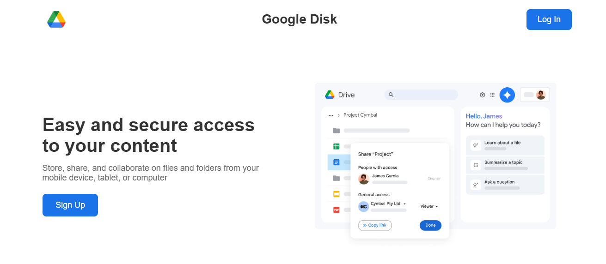
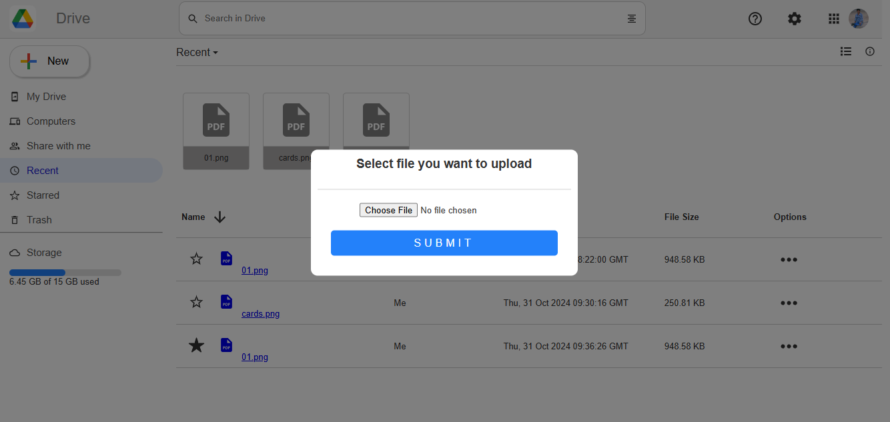
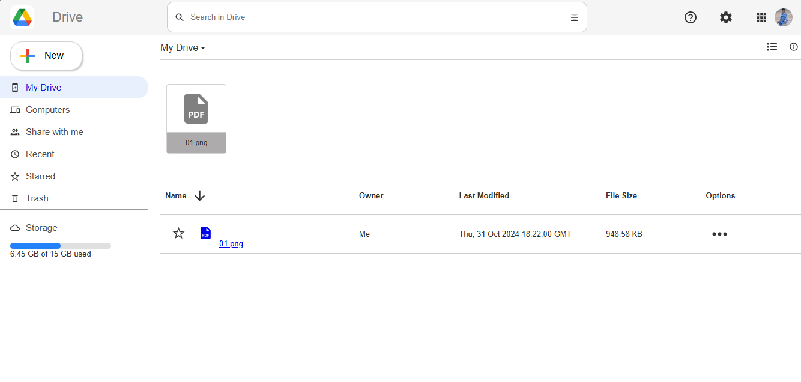
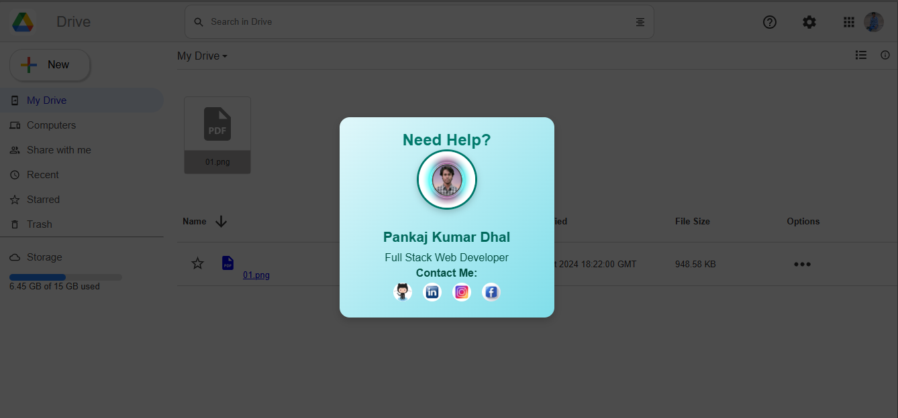
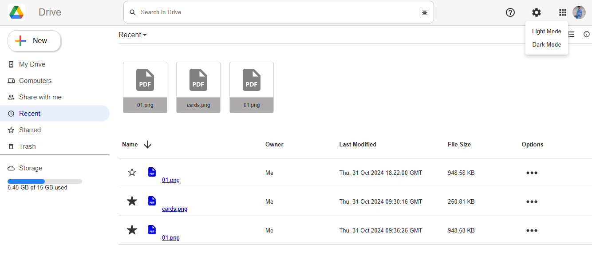
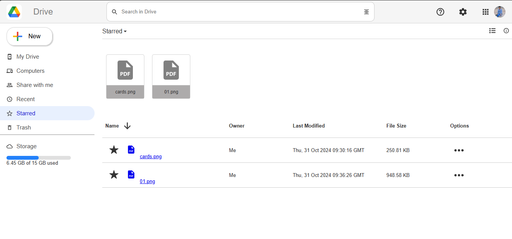
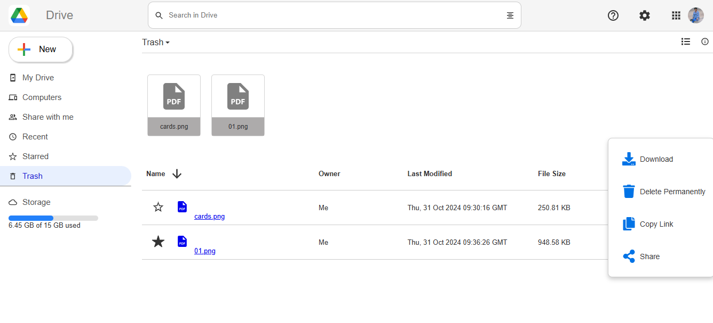
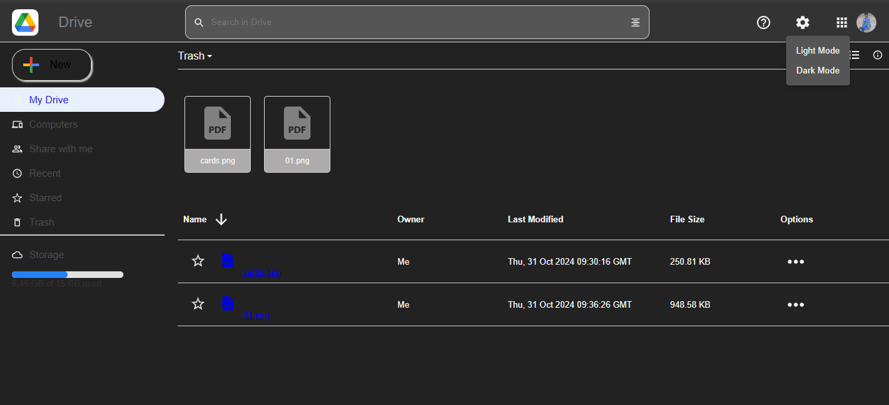

# Google Drive Clone

This project is a Google Drive-inspired web application that enables users to manage and organize their files online. The app allows you to log in, upload, search, organize files, and toggle between light and dark themes.

## Table of Contents

- [Features](#features)
- [Demo](#demo)
- [Technologies Used](#technologies-used)
- [Getting Started](#getting-started)
- [Usage](#usage)
  - [Login & Sign Up](#login--sign-up)
  - [File Management](#file-management)
  - [Search](#search)
  - [Light & Dark Mode Toggle](#light--dark-mode-toggle)
- [File Upload](#file-upload)
- [Future Enhancements](#future-enhancements)
- [Contributing](#contributing)
- [License](#license)

## Features

- **Login & Signup**: Users can sign in with Google authentication.
- **File Upload**: Upload files to your personal drive.
- **Search**: Search through files and folders in real time.
- **My Drive**: Store and access all uploaded files.
- **Recent**: View recently uploaded or accessed files.
- **Starred**: Mark files as important to access them quickly.
- **Trash**: Deleted files are moved here and can be permanently removed.
- **Download, Copy, Share**: Options to manage files.
- **Dark/Light Mode**: Toggle between dark and light themes.
- **Hepl Desk**: Users can contact with developer for help.

## Screenshots

### Sign Up & Login Screen


### Main Dashboard


### Upload File


### My Drive


### Contact & Help


### Recent Files


### Starred Files


### Trash


### Dark Mode

  
## Demo

*(Add a live demo link here if hosted, e.g., on Vercel)*

## Technologies Used

- **React** with **Vite** for front-end development.
- **Firebase Authentication** for secure login.
- **Firebase Firestore** for file metadata storage.
- **Firebase Storage** for file storage.
- **Tailwind CSS** for styling and responsive design.

## Getting Started

### Prerequisites

Make sure you have [Node.js](https://nodejs.org/) installed on your machine.

### Installation

1. Clone the repository:

   ```bash
   git clone https://github.com/PankajKumarDhal/google-drive-clone.git
   cd google-drive-clone
   
